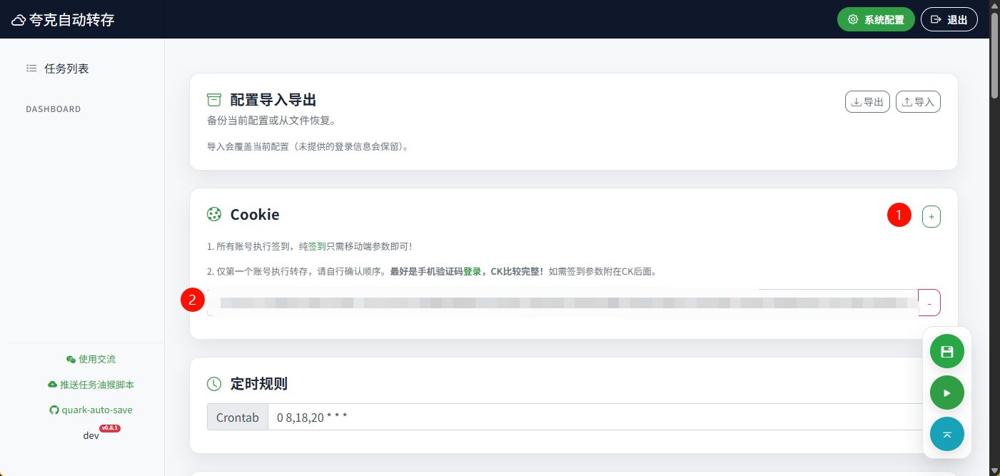
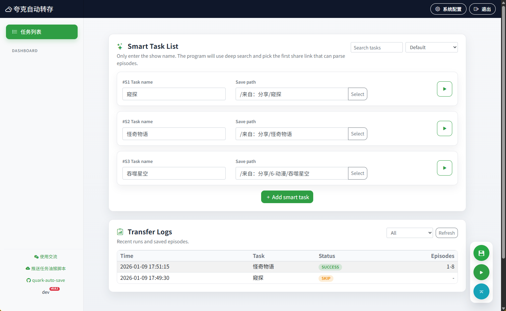

# 夸克网盘自动转存 (quark-auto-save)

面向夸克网盘的自动转存/追更工具。支持定时任务、智能搜索、正则重命名、插件扩展，并提供 Web UI 管理。

## 功能特性
- 多账号签到领取空间；转存仅使用第 1 个 cookie
- 任务定时转存（crontab + 按周/截止日期）
- 正则匹配与“魔法变量”重命名，支持忽略扩展名去重
- 智能任务：按名称自动搜索分享源，支持最近 N 集
- 子目录更新与可选“重存模式”
- Web UI 管理配置/任务、导入导出、手动运行、日志查看
- 插件机制：alist / alist_strm / alist_strm_gen / alist_sync / aria2 / emby / plex / smartstrm / fnv
- 多渠道通知（见 `notify.py` 与 `push_config`）
- 转存日志落库 `config/transfer_logs.db`

## 快速开始

### 1) 脚本方式
1. 安装依赖  
   `pip install -r requirements.txt`
2. 编辑配置  
   CLI 默认读取根目录 `quark_config.json`，也可传入自定义配置路径
3. 运行  
   `python quark_auto_save.py`  
   或：`python quark_auto_save.py path/to/config.json`

### 2) Web UI
启动：`python app/run.py`  
默认地址：`http://localhost:5005`  
默认账号：`admin / admin123`（可用 `WEBUI_USERNAME` / `WEBUI_PASSWORD` 覆盖）

Web UI 支持：任务管理、智能任务、正则预览、导入导出配置、手动运行、日志查看等。

### 3) Docker
```bash
docker build -t quark-auto-save .
docker run -d --name quark-auto-save -p 5005:5005 \
  -v "$(pwd)/config:/app/config" \
  -v "$(pwd)/plugins:/app/plugins" \
  quark-auto-save
```

## FnOS / Portainer 部署（推荐 Docker Compose）

### 部署方式一：本机 Compose（Git 作为构建上下文）
> 适合直接在 FnOS 终端运行，Compose 会从仓库拉取最新代码构建镜像。

1. 准备 `docker-compose.yml`（已在仓库内）
2. 启动
   ```bash
   docker compose up -d --build
   ```
3. 访问 Web UI  
   `http://<FnOS_IP>:5005`（默认账号 `admin / admin123`）

**更新（拉最新代码重建）：**
```bash
docker compose up -d --build
```

### 部署方式二：Portainer（Stack + Git）
1. Portainer → Stacks → Add stack → 选择 Git repository  
2. 填仓库地址，Compose 路径选 `docker-compose.yml`  
3. Deploy stack  

**更新（拉最新代码重建）：**  
在 Stack 页面点 **Update the stack**（勾选 re-pull image / re-build）。

### 配置/插件持久化
当前 `docker-compose.yml` 使用命名卷：
```yaml
services:
  quark-auto-save:
    build:
      context: https://github.com/dlagez/quark-auto-save.git
      dockerfile: Dockerfile
    ports:
      - "5005:5005"
    environment:
      - TZ=Asia/Shanghai
      - WEBUI_USERNAME=admin
      - WEBUI_PASSWORD=admin123
    volumes:
      - quark_config:/app/config
      - quark_plugins:/app/plugins

volumes:
  quark_config:
  quark_plugins:
```
如需迁移或备份配置，可将命名卷内容导出或改为绑定宿主机目录。

## 配置文件说明
默认配置文件：`quark_config.json`  
Web UI 默认使用：`config/quark_config.json`（不存在时会从根目录拷贝）

> 注意：配置文件包含 cookie 等敏感信息，请勿提交到公共仓库。

### 核心字段
- `cookie`：字符串或数组；仅第 1 个 cookie 用于转存，其余账号用于签到
- `tasklist`：普通任务列表（手动填写 shareurl）
- `smart_tasklist`：智能任务列表（按名称搜索分享源）
- `crontab`：定时规则（Web UI）
- `push_config`：通知配置（详见 `notify.py`）
- `plugins`：插件配置（详见 `plugins/README.md`）
- `magic_regex`：魔法正则规则（供 pattern 引用）

### 任务字段（tasklist / smart_tasklist）
- `taskname`：任务名称
- `shareurl`：分享链接（smart_tasklist 可留空或用 `manual_shareurl`）
- `savepath`：保存路径（以 `/` 开头；智能任务可写 `.../TASKNAME` 自动替换）
- `pattern` / `replace`：正则匹配与替换；`pattern` 可直接填 `magic_regex` 的 key
- `ignore_extension`：忽略扩展名去重
- `runweek`：运行星期（1-7）
- `enddate`：截止日期（YYYY-MM-DD）
- `update_subdir`：匹配子目录的正则
- `update_subdir_resave_mode`：子目录“重存模式”
- `updated_after`：仅转存此时间之后更新的文件（YYYY-MM-DD 或 ISO）
- `recent_episodes`：只保存最近 N 集（常用于智能任务）
- `save_whole_folder`：是否连文件夹一起保存
- `startfid`：遇到指定 fid 后停止遍历

### 魔法变量（重命名）
`replace` 中可使用：
- `{TASKNAME}`、`{SXX}`、`{E}`、`{DATE}`、`{YEAR}`
- `{I}` / `{II}` / `{III}`：自动编号
- `{EXT}`：扩展名

更多规则可在 `magic_regex` 中自定义。

### 配置示例
```json
{
  "cookie": ["<your cookie>"],
  "tasklist": [
    {
      "taskname": "示例剧",
      "shareurl": "https://pan.quark.cn/s/xxxx",
      "savepath": "/影视/示例剧",
      "pattern": "$TV",
      "replace": "{TASKNAME}.{SXX}E{E}.{EXT}",
      "runweek": [1, 3, 5],
      "enddate": "2099-12-31"
    }
  ],
  "smart_tasklist": [
    {
      "taskname": "示例综艺",
      "savepath": "/追更/TASKNAME",
      "recent_episodes": 2
    }
  ]
}
```

## 常用环境变量
- `WEBUI_USERNAME` / `WEBUI_PASSWORD`：Web UI 登录账号
- `HOST` / `PORT` / `DEBUG` / `TASK_TIMEOUT`：Web UI 运行参数
- `CONFIG_PATH` / `SCRIPT_PATH` / `PYTHON_PATH`：Web UI 调用脚本参数
- `TRANSFER_LOG_DB`：转存日志数据库路径
- `TASKLIST` / `SMART_TASKLIST`：只运行指定任务（JSON）
- `SMART_CANDIDATES_ONLY` / `SMART_TEST_ONLY`：智能任务搜索/测试模式

## 截图
### 添加 Cookie


### 添加智能任务

